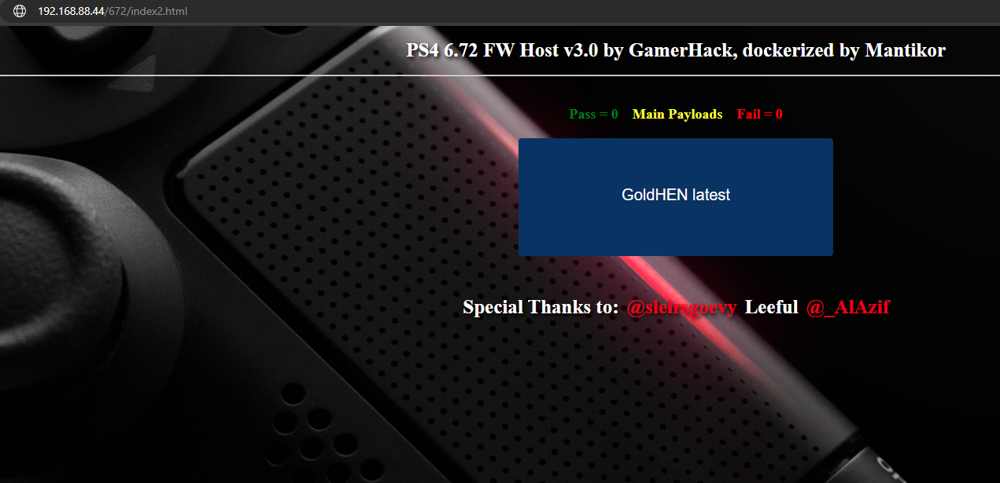
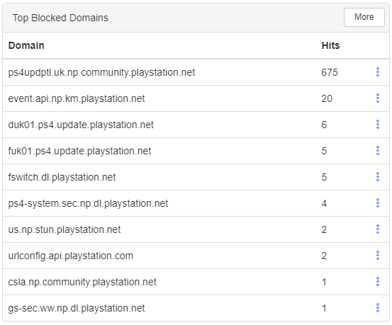
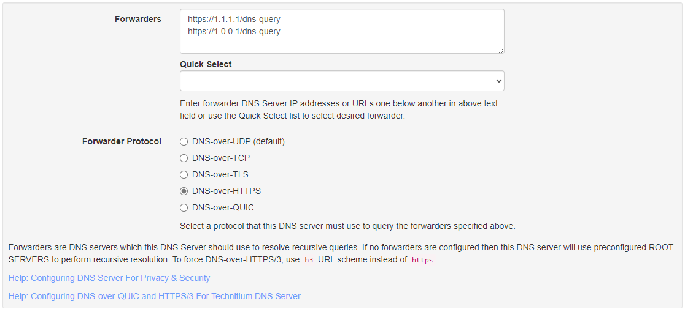

# Docker containers for local using. Latest version GamerHack host + DNS blocker + simple page for activation GoldHEN (this page avoiding children press other buttons, only for FW 6.72).

# Docker контейнеры для локального использования последней версии хоста от GamerHack + блокировщик DNS + упрощённая страница для активации GoldHEN (чтобы дети не нажали лишних кнопок, сделано только для версии ПО 6.72).

## Russian/Русский

### Настройки:

- настройка порта веб-сервера хранится в файле `.env` в переменной `PORT`, значение по умолчанию `PORT=80`, не меняйте это значение без необходимости

### Запуск:

- установить `git`
- выполнить команду `git clone https://github.com/Mantikor/playstation_utils`
- выполнить команду `cd playstation_utils` или зайти в папку, куда клонировали репозиторий (папку с файлом `docker-compose.yml`)
- выполнить команду `docker compose up`
- для блокировки доменов зайти на консоль, выбрать Настройки, в разделе Сеть, в настройках DNS указать ip-адрес устройства, где запущен контейнер
- ниже смотрите адреса для доступа к утилитам и к активации GoldHEN

### Обновление файлов хоста от GamerHack:

 - зайти в папку с файлом `docker-compose.yml`
 - выполнить команду `docker compose down`
 - `docker compose build --no-cache`
 - `docker compose up`

### Адреса страниц для быстрого перехода:

- `SERVER_IP_ADDRESS:PORT_FROM_ENV/672/index.html` или `SERVER_IP_ADDRESS/672/index.html` (если не меняли `PORT` в `.env` файле) - упрощённая страница для активации последней версии GoldHEN для PS4 c версией ПО 6.72, закэшируется в браузер, в дальнейшем подключение к интернету будет не нужно
- `SERVER_IP_ADDRESS:PORT_FROM_ENV/672/index2.html` или `SERVER_IP_ADDRESS/672/index2.html` (если не меняли `PORT` в `.env` файле) - меню хоста от GamerHack для версии ПО 6.72
- `SERVER_IP_ADDRESS:PORT_FROM_ENV` или `SERVER_IP_ADDRESS` (если не меняли `PORT` в `.env` файле) - главное меню хоста от GamerHack
- `YOUR_SERVER_IP_ADDRESS:5380` - панель управления DNS сервером

### DNS server:

Используется сервер _Technitium DNS Server_, настройки по умолчанию, логин/пароль по умолчанию _admin_/_admin_, заблокированы домены: _playstation.com_, _playstation.net_, _playstation.org_, _scea.com_, _sie-rd.com_, _sonyentertainmentnetwork.com_ (включая поддомены), все остальные запросы проксируются через _DNS-over-HTTPS_ серверы Cloudflare https://1.1.1.1/dns-query и https://1.0.0.1/dns-query, любые нужные вам настройки вы можете сделать через панель управления.

## English

### Settings:

- web-server serve port is in `.env` file in the `PORT` variable, default value `PORT=80`, don't change this parameter unless necessary 

### Running:

- install `git`
- run command `git clone https://github.com/Mantikor/playstation_utils`
- run command `cd playstation_utils` or go to the folder where you cloned the repository (folder with file `docker-compose.yml` inside)
- run command `docker compose up`
- for block domains you need to open Setting on your console, go Network, DNS settings, put ip-address of your machine with running container
- page links with utilities and DoldHEN activation page see below

### Update host files from GamerHack:

 - open folder with `docker-compose.yml` inside
 - run command `docker compose down`
 - `docker compose build --no-cache`
 - `docker compose up`

### Local URL shortcuts:

- `SERVER_IP_ADDRESS:PORT_FROM_ENV/672/index.html` or `SERVER_IP_ADDRESS/672/index.html` (for default `PORT` in `.env` file) - simple page GoldHEN activation for PS4 with FW 6.72, will caching in the browser, will not need internet connection
- `SERVER_IP_ADDRESS:PORT_FROM_ENV/672/index2.html` or `SERVER_IP_ADDRESS/672/index2.html` (for default `PORT` in `.env` file) - GamerHack host menu for PS4 FW 6.72
- `SERVER_IP_ADDRESS:PORT_FROM_ENV` or `SERVER_IP_ADDRESS` (for default `PORT` in `.env` file) - main menu of GamerHack host
- `YOUR_SERVER_IP_ADDRESS:5380` - admin panel of DNS server

### DNS server:

Using _Technitium DNS Server_, default settings, default login/password _admin_/_admin_, blocked domains: _playstation.com_, _playstation.net_, _playstation.org_, _scea.com_, _sie-rd.com_, _sonyentertainmentnetwork.com_ (include subdomains), all other requests will proxy with _DNS-over-HTTPS_ servers Cloudflare https://1.1.1.1/dns-query and https://1.0.0.1/dns-query, all other settings you can change in admin panel.

